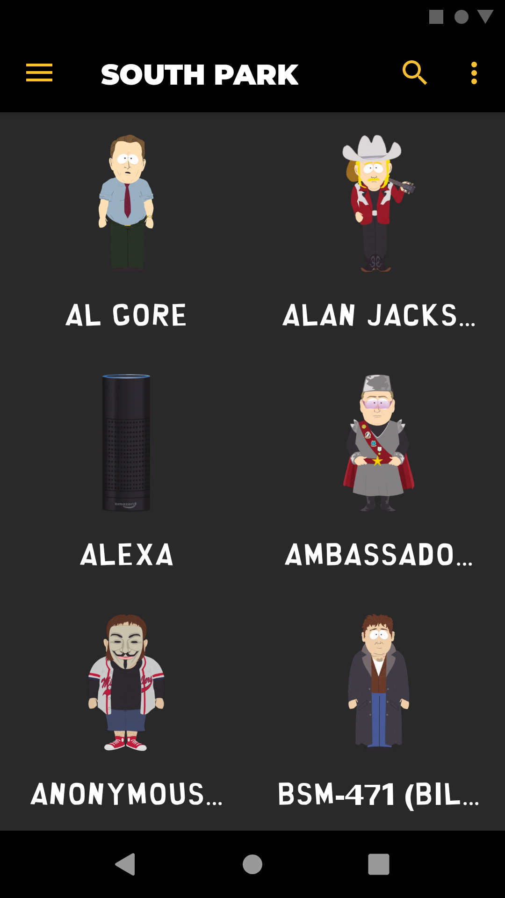
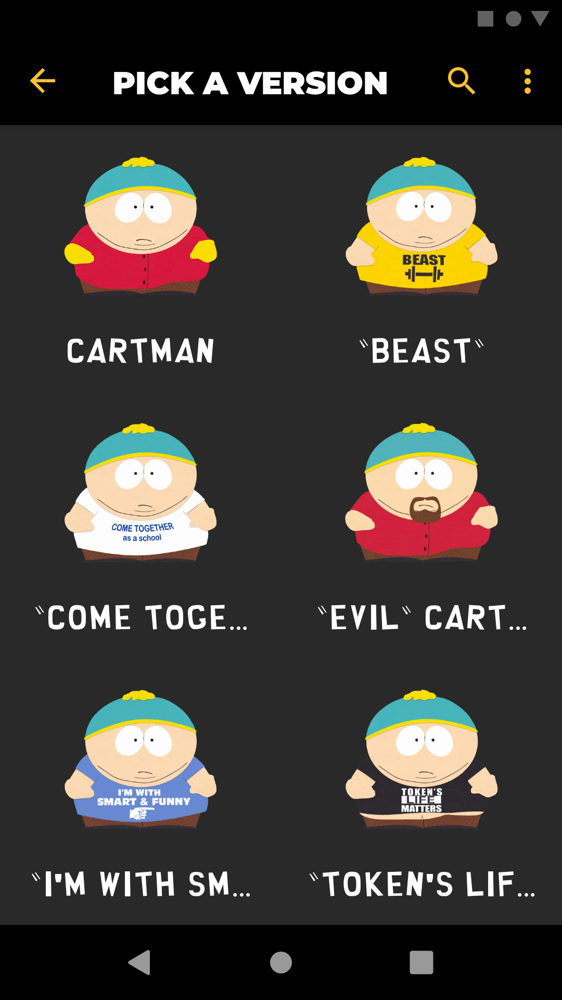
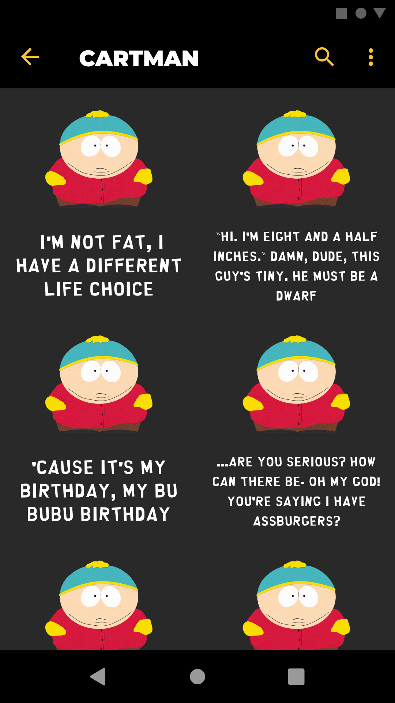

# South Park Soundboard

  

The South Park Soundboard is the ultimate hub for true South Park fans!

Listen to over 5000 audio clips from over 270 different characters, spanning
the first 23 seasons of South Park.

Instantly playback your favorite South Park quotes with on-demand audio clips.

Listen to quotes from characters such as Cartman, Kyle, Stan, Kenny, Butters, Randy, Towelie, Mr. Garrison, Tweek, Mr. Hankey, Chef, PC Principal, Mr. Mackey, Terrance and Phillip, and so much more, all straight from your phone!

Explore the depths of the South Park universe by going through alter-egos of characters such as Cartman's "The Coon", Kenny's "Mysterion", Butters' "Professor Chaos", and even more niche alter-egos like Cartman's "Officer Cartman", which was featured in the Season 2 episode, "Chickenlover", and many more.

Instantly find quotes or songs by using the search tool to find exactly what you are looking for.

You can also long-press any audio clip to do any of the following actions:

-	Add audio clips to your list of favourites
-	Share audio clips
-	Set audio clips as ringtones, notification tones, and alarm tones
-	Display the full title and duration of any audio clip

## Download the South Park Soundboard

The latest version of the South Park Soundboard (v1.0.7) can be downloaded from any of the following locations:

Or through [Direct Download](https://github.com/soundbytesdotme/south-park-soundboard/releases/download/v1.0.7/south-park-soundboard-1.0.7.apk) via this repo's [releases](https://github.com/soundbytesdotme/south-park-soundboard/releases) page.

When downloading from either location, check the URL bar of your browser to ensure you are in the correct place and not visiting a phishing link.

### Releases

All version releases of the app can be found at the releases section of this repo: https://github.com/soundbytesdotme/south-park-soundboard/releases.

